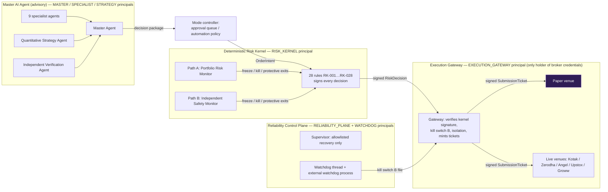
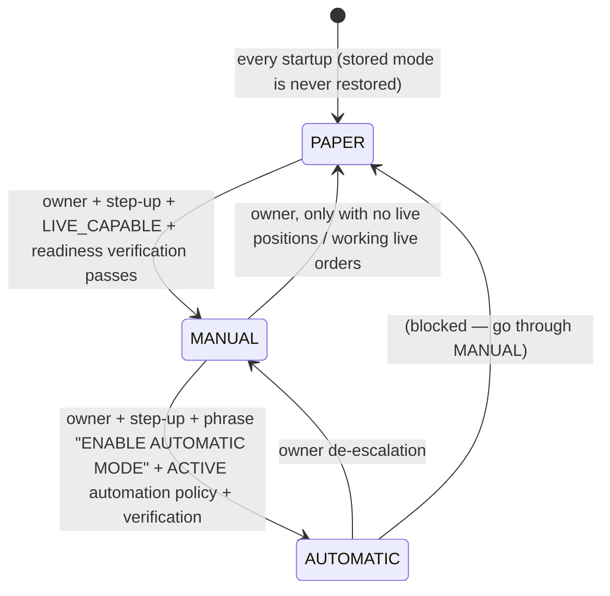

# AI Market Risk Terminal — Architecture

A human-governed options risk platform. **The Master AI Agent coordinates intelligence; specialist agents advise; the
Deterministic Risk Kernel validates; the Execution Gateway submits authorized orders; the Reliability Control Plane
maintains infrastructure within bounded permissions.** No component can do another component's job: each runs as its
own principal with a fixed capability set (see [PERMISSION_MATRIX.md](PERMISSION_MATRIX.md)).

## 1. Four independently permissioned components



| Component | Can | Can never |
|---|---|---|
| Specialist agents (9) | read immutable context snapshots, publish advice | import execution/broker/kernel/storage code (AST-tested), hold credentials, request execution |
| Quantitative Strategy Agent | propose a structured action | authorize or execute it |
| Master Agent | aggregate, resolve disagreement, produce decision packages (ADVISORY / REQUIRES APPROVAL / NO ACTION / REJECTED / INSUFFICIENT DATA) | set AUTHORIZED, call the gateway, sign risk decisions |
| Risk Kernel | evaluate every order, sign decisions, freeze new risk | submit orders, release its own freezes |
| Execution Gateway | persist intents, verify signed decisions, mint single-use tickets, submit once | change policy, override a rejection, retry an ambiguous submission |
| Reliability Control Plane | RECONNECT_STREAM, RENEW_SESSION, RESTART_WORKER, REBUILD_CACHE, REPLAY_CONSUMER, RESTORE_CONFIG, QUARANTINE_COMPONENT, RECOMPUTE_ANALYTICS, ENTER_READ_ONLY, NOTIFY | submit/cancel/modify orders, change mode/policy/limits, release freeze/kill/recovery lock, unquarantine, edit positions, delete records |
| Owner (human) | approve, change mode (step-up), policies, releases after verification, Manual Quick Exit | bypass the kernel (no API exists that does) |

## 2. Module and agent responsibility matrix

| Module | Path | Responsibility |
|---|---|---|
| Market data & instrument master | `marketdata/` | provenance-labelled quotes and chains, sequence/gap/duplicate checks, freshness, LIVE DATA VERIFIED rules, replay, SIMULATED demo market |
| Broker integrations | `brokers/` | official SDK adapters, read-only data facade, live venues (ticket-checked), capability profiles |
| Option-chain analytics | `analytics/option_chain.py` | ATM ± N window, max / 2nd OI, buildup/unwinding, Total-OI and Change-in-OI PCR, look-back windows, concentration, labelled inferences |
| FII/DII | `analytics/fii_dii.py`, `services.py` | official NSE file parsing with total checks, revisions, period aggregation with completeness |
| Quant & backtesting | `quant/` | strategy recipes, dated charges, backtest, walk-forward, sensitivity, stress, leakage checks |
| Specialist agents | `agents/specialists.py`, `strategy.py`, `verification.py` | 11 agents (below) |
| Master orchestrator | `agents/master.py`, `orchestration.py` | decision packages, routing by mode |
| Manual / automatic mode | `modes/` | approval gate, automation controller, mode controller |
| Paper simulator | `execution/paper.py` | SIMULATED fills against fresh quotes, isolated from brokers |
| Risk Kernel | `risk/kernel.py`, `policy.py`, `margin.py` | deterministic rules, versioned policies, hard limits |
| Execution Gateway & lifecycle | `execution/` | intents, tickets, order state machine, reconciliation |
| Portfolio accounting | `portfolio/ledger.py` | positions, realized/unrealized P&L, charges, missing marks → unavailable |
| Dual kill switch & emergency | `risk/emergency.py`, `risk/monitors.py`, `risk/protective.py` | latched safety state, Path A/B, pre-authorized protective exits |
| Security | `security/` | principals & capabilities, auth (scrypt, TOTP, lockout, step-up), HMAC signing, redaction, untrusted-text handling |
| Event store / audit / replay | `events/store.py`, `api/server.py::replay_summary` | append-only hash-chained log, idempotent appends, replay |
| Reliability | `reliability/` | health (liveness ≠ readiness ≠ safety readiness), incidents, alerts, supervisor, watchdog |
| Monitoring / DR | `core/metrics.py`, `services.py`, `ops.py`, `deploy/` | metrics, backups, restore, rollback |
| Dashboard & API | `api/server.py`, `../frontend` | FastAPI + WebSocket, Next.js static dashboard |

| Agent | Kind | Critical | Output |
|---|---|---|---|
| market_intelligence | specialist | yes | returns, realized vs implied vol, regime (inference) |
| option_chain_intelligence | specialist | yes | max-OI walls, buildup/unwinding, coverage |
| pcr_positioning | specialist | no | PCR levels and changes per window |
| fii_dii | specialist | no | official end-of-day positioning, staleness |
| portfolio_exposure | specialist | no | model Greeks, P&L, missing marks |
| risk_advisory | specialist | yes | distance to level 1/2, blockers |
| broker_health | specialist | no | sessions, reconciliation age |
| news_events | specialist | no | expiry day, owner-supplied calendar, quarantined injection attempts |
| security_operations | specialist | yes | audit chain, config integrity, denials, failed logins |
| quantitative_strategy | strategy | no | the only proposal source |
| independent_verification | specialist | yes | recomputes PCR/max-OI from raw rows, checks every leg |

## 3. Operating modes



* **PAPER — NO REAL ORDERS**: only the PAPER-1 account and the paper venue; PAPER intents cannot name a live broker
  (schema), the gateway refuses to route them anywhere else, and live venues refuse PAPER tickets.
* **MANUAL — OWNER CONTROL**: AI packages land in the approval queue; acceptance needs a fresh step-up.
* **AUTOMATIC — MASTER AI COORDINATION — RISK ENGINE ENFORCED**: only actions inside the ACTIVE, unexpired automation
  policy (strategy/version, underlying, order type, lots, window); everything else follows the policy fallback.
* Safety components never change mode; they freeze, suspend AI or engage kill switches instead.

## 4. Order lifecycle

```mermaid
stateDiagram-v2
  [*] --> INTENT_PERSISTED: UNIQUE idempotency key (duplicate → existing order returned, nothing sent)
  INTENT_PERSISTED --> REJECTED_PRE_TRADE: kernel / signature / kill switch B / isolation / clash
  INTENT_PERSISTED --> SUBMITTING: ticket minted, persisted first
  SUBMITTING --> ACKNOWLEDGED
  SUBMITTING --> REJECTED: definitive broker rejection
  SUBMITTING --> UNKNOWN: timeout / ambiguous error (never retried)
  ACKNOWLEDGED --> PARTIALLY_FILLED --> FILLED
  ACKNOWLEDGED --> FILLED
  ACKNOWLEDGED --> CANCELLED
  UNKNOWN --> FILLED: reconciliation finds it
  UNKNOWN --> ACKNOWLEDGED
  UNKNOWN --> NOT_FOUND_AT_BROKER: absent from ≥2 complete order-book reads after the grace period
```

While any order is `ORDER STATE UNKNOWN`, RK-013 blocks all new risk and blocks any order on that instrument; Path B
freezes new risk after 30 s; protective exits on that instrument wait for reconciliation.

## 5. Kill-switch design

* **Switch A** — database-backed latched state, evaluated by the kernel (RK-001).
* **Switch B** — a file (`runtime/KILL_SWITCH`) checked *directly* by the gateway before every submission and also by the
  kernel; written first on engage. The in-process watchdog thread and the external watchdog process can write it without
  the event loop or the database. On startup and every second the two are aligned (`sync_from_file`).
* Both block **new risk only**; reduce-only and protective exits keep working.
* Release: owner + fresh step-up + `verify_recovery()` passing (computed server-side, never supplied by the client).

## 6. Recovery flows

```mermaid
flowchart TD
  F[Component FAILED/STALE] --> I[Incident opened (never deleted)]
  I --> C{critical?}
  C -->|yes| RO[ENTER_READ_ONLY: freeze + recovery lock]
  C -->|no| A
  RO --> A[Allowlisted actions with backoff 5 s / 15 s / 45 s]
  A --> V{healthy and ready?}
  V -->|yes| R[Incident RECOVERING; latched safety state unchanged]
  V -->|no, attempts exhausted| E[critical: escalate to owner · non-critical: QUARANTINE + NOTIFY]
  R --> O[Owner reviews → verify_recovery passes → owner releases freeze / lock]
```

`verify_recovery()` checks: database reachable, audit hash chain intact, every critical component healthy and ready,
no ORDER STATE UNKNOWN, every live account reconciled within 60 s without divergence, every held instrument fresh.

## 7. Reconciliation

Every 10 s per account: broker order book, positions and funds are read. Orders are matched by broker id, then by the
client tag derived from the idempotency key. Fills are applied idempotently (only increments). Position differences are
adopted from the broker (source of truth) and **freeze new risk** (`POSITION_DIVERGENCE`) until the owner reviews.
Funds refresh the margin-risk denominator (start-of-day funds are captured once per IST day). A failed read leaves the
account stale; RK-012 then blocks new live risk.

## 8. Configuration and policy versioning

* **Hard limits** come from the deployment environment only and cap every policy (`HardLimits`).
* **Risk and automation policies** are versioned rows: DRAFT → ACTIVE (owner + step-up), previous ACTIVE → SUPERSEDED;
  every decision records the policy version and hash it was evaluated under.
* **Configuration integrity**: the redacted effective configuration is hashed and versioned; the owner marks a version
  known-good; drift raises an alert and blocks entering MANUAL/AUTOMATIC.
* **Schema**: numbered migrations (`storage/db.py`), applied idempotently at startup; `python -m amrt verify` checks
  schema version and the audit chain.

## 9. Directory tree

```
amrt/
  amrt/            backend package (see §2)   frontend/   Next.js dashboard (static export in out/)
  tests/           unit, integration (PostgreSQL+Redis), contract, security, quant, e2e, chaos, recovery, replay, acceptance
  docs/            this documentation            deploy/     Dockerfile, docker-compose.yml, scripts/
  evidence/        junit.xml, coverage.xml, test logs, rehearsal logs
```
